# Switchyard

> 打破 AI 代理的模型孤岛。一份配置，所有模型，所有代理，无缝协作。

[]()
[]()
[]()

---

## 你遇到了这些问题吗？

- 在 **Codex** 里只能用官方模型，DeepSeek 的思考和速度、Kimi 的性价比、GLM 的性价比——全和你无关
- 换成 **Claude Code**，又要重新配置一遍 API Key，两边的模型列表从来不统一
- **cc-switch** 能配置三方模型，但每次切换都需要点击一下启用某个供应商的模型，相关agent仅能看到该供应商下的模型
- 模型多了以后根本不知道哪个挂了、哪个可用——打开终端一条条 `curl` 试？还是盲猜？
- DeepSeek 不支持贴图，报错了也不知道为什么；想换个支持视觉的模型又要切来切去
- 想看某个代理发了什么 prompt、为什么那个请求失败了——日志散落在各个地方，根本拼不起来

**Switchyard 一次性解决所有这些问题。** 它是一个运行在你本机的桌面应用：左边面板配置模型，右边所有 AI 代理自动生效。

---

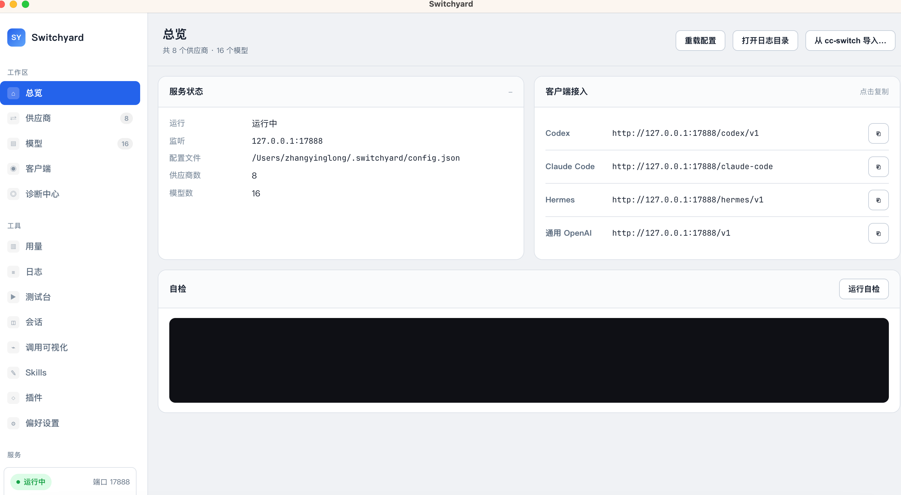


---

## 六大核心能力

### ① 统一模型矩阵

**一个地方配置，所有代理可用。**

Switchyard 把你在所有平台申请的模型——OpenAI、DeepSeek、Kimi、GLM、MiniMax、火山引擎、硅基流动、OpenRouter 以及任意 OpenAI-compatible 供应商——聚合到一个面板里。配置完成后，Codex、Claude Code、Hermes 以及所有兼容 OpenAI/Anthropic 协议的工具同时可见。

> 你不再需要记「Codex 用的是哪个 key」「Claude Code 配了哪几个模型」。一个地方改，全部自动同步。

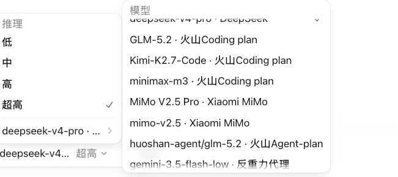
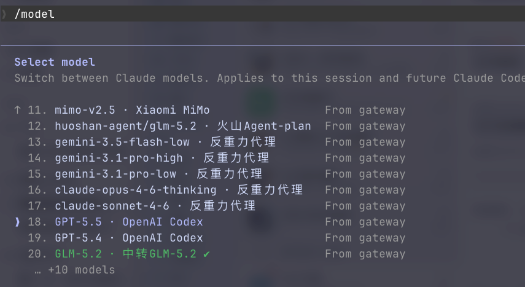

**支持的供应商（持续扩充）：**

| 供应商 | 协议适配 | 特色处理 |
|--------|----------|----------|
| OpenAI (Codex OAuth) | Responses | 官方 GPT/Codex，OAuth 直连 |
| DeepSeek | Chat | reasoning_content 正确映射到各类代理 |
| Kimi (Moonshot) | Chat | Function Calling schema 自动清洗 |
| GLM (智谱) | Chat | content 数组格式自动适配 |
| MiniMax | Chat | reasoning_details 正确映射 |
| Anthropic | Messages | 原生 Messages 协议 |
| 火山引擎 Agent Plan | Chat | 国产大模型代理 |
| OpenRouter | Chat | reasoning effort 透传 |
| 硅基流动 | Chat | enable_thinking 映射 |
| 任意 OpenAI-compatible | Chat | 通用适配 |

---

### ② 全局诊断中心

**不用猜哪个模型挂了。**

诊断中心提供全量供应商和模型的实时可用性检测。一眼看清：

- 哪些模型状态正常、哪些延迟偏高、哪些已不可达
- 每个供应商的协议兼容性：是否存在不支持的参数、Schema 不匹配等潜在问题
- 按模型 / 供应商 / 代理的切面统计请求成功率、平均延迟、Token 消耗

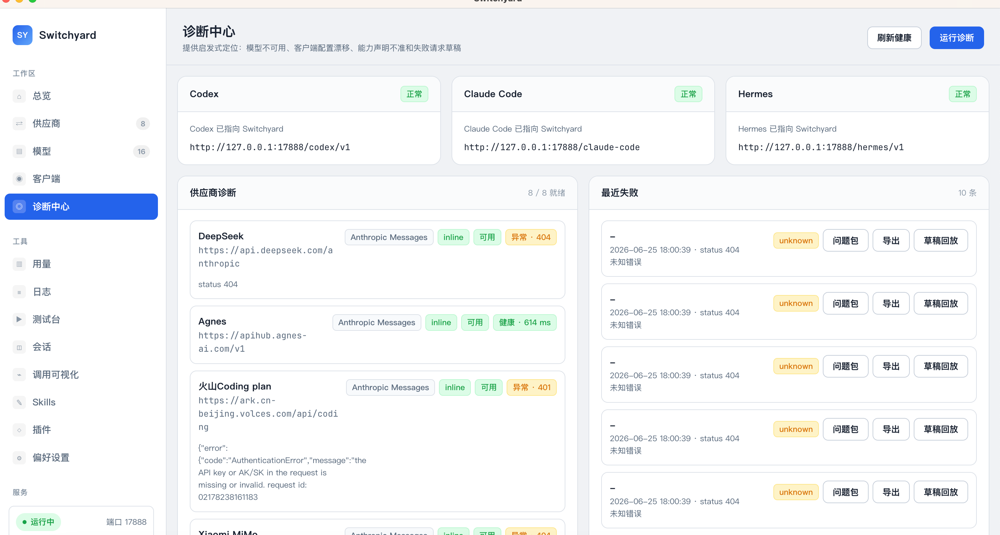
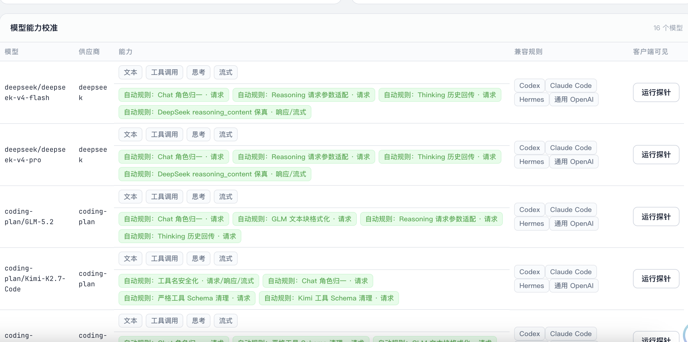

错误自动分类（认证失败、上游拒绝、协议不兼容、网络不可达），每条都有明确的修复建议。一键导出 sanitized 诊断包，自动剥离敏感信息，可以直接发给同事排查。

---

### ③ 会话历史管理

**跨代理查看所有对话记录，格式化展示。**

Switchyard 解析 Codex、Claude Code、Hermes 的本地会话存档，提供统一的历史浏览器：

- 按代理、模型、时间范围筛选
- 每条会话展示模型名、Token 消耗、关键摘要
- 支持会话内容格式化渲染——Codex 的 Responses Protocol、Claude Code 的 Messages Protocol 统一展示
- 在官方直连模式和代理模式间切换时，**已有会话的 model_provider 自动迁移，对话记录不丢失**

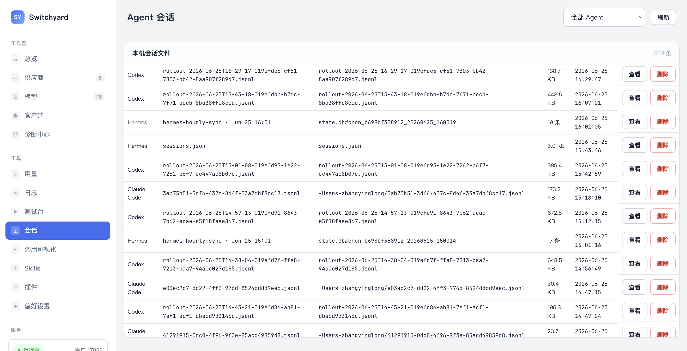

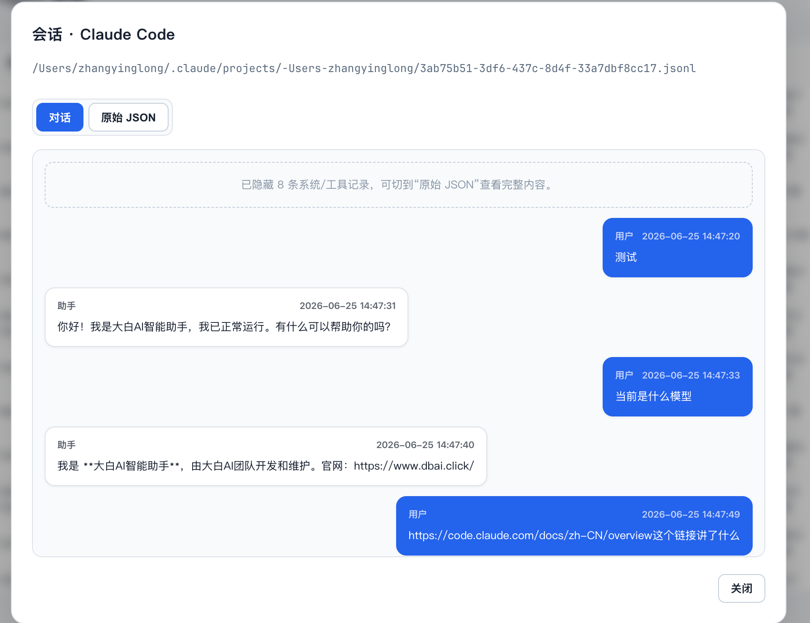

---

### ④ 实时请求监控

**学习各代理的 prompt 工程，第一时间排障。**

调用可视化面板实时展示流经网关的每一条请求：

- 请求状态（200 / 4xx / 5xx）、延迟、Token 用量
- 请求方法和路径的协议信息、上游模型路由
- 每条请求可展开查看详细元信息：协议转换链、激活的兼容补丁、请求覆盖

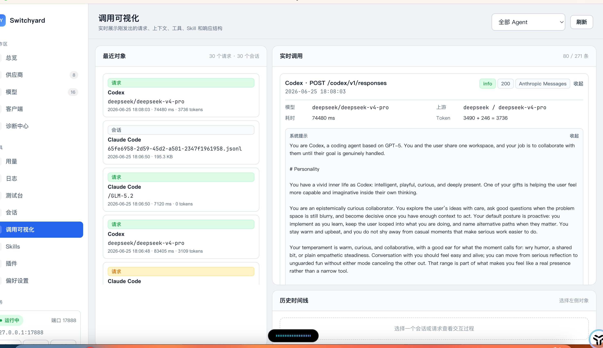

这意味着你可以：
- **学习 Codex / Claude Code 如何构造 prompt**，把优秀工程实践用在自己的场景里
- **立即发现配置问题**：模型路由错了、协议适配没生效、Token 超限——不用翻日志文件

---

### ⑤ 多代理 Skill 管理

**集成腾讯 Skill Hub，一键搜索安装。**

Skill 管理面板让你统一管理 Codex 和 Claude Code 的 Skills：

- 查看当前已安装的全部 Skills，按代理分列
- **接入腾讯 Skill Hub**：搜索官方和社区的 Skills，一键安装
- 支持 Marketplace 管理：浏览、安装、卸载

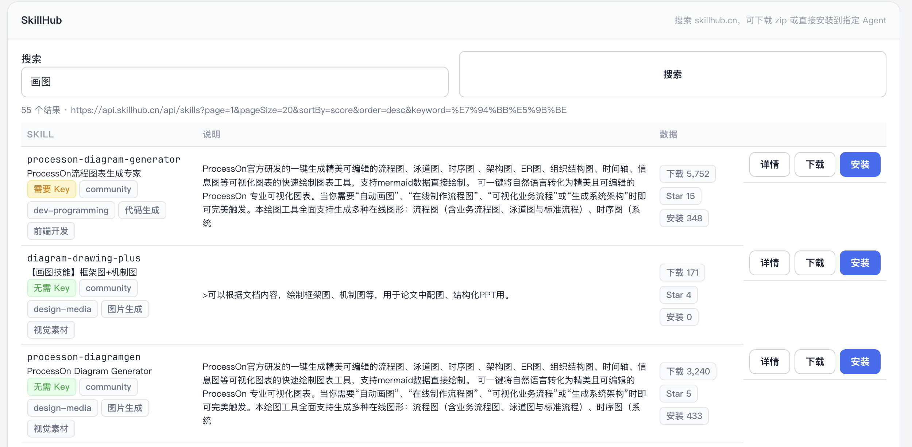
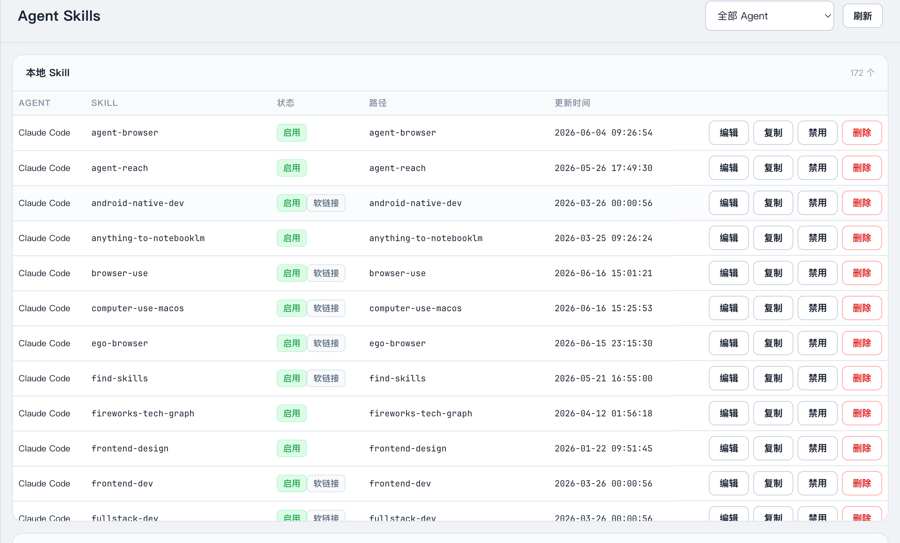

---

### ⑥ 非视觉模型识图

**让 DeepSeek 这样不支持图片的模型也能"看图"。**

很多高性价比模型的 API 不支持图片输入（如 DeepSeek v4-pro、GLM5.2），Switchyard 内置视觉 Fallback 引擎：

> 贴图 → Switchyard 自动用视觉模型描述图片 → 将文字描述注入 prompt → 发送给目标模型

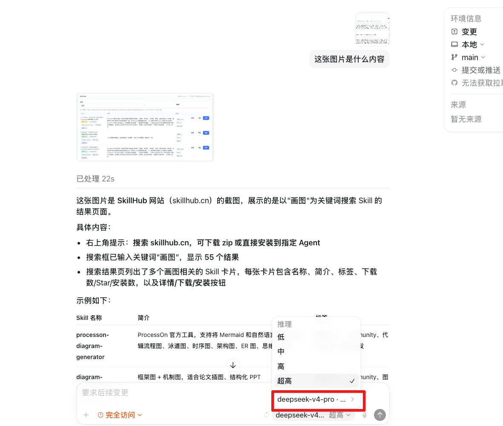

配置简单：在模型配置中开启「视觉 Fallback」并指定一个兜底视觉模型（如 xiaomi V2.5）。之后所有向该模型发送的图片请求，都会自动走描述→注入流程。

---

## ⚠️ 使用 Codex 官方模型的重要提醒

在 Codex 中使用 GPT 等官方模型时，Switchyard 提供两种接入方式：

| 方式 | 原理 | 风险 |
|------|------|------|
| **官方直连**（推荐） | Codex 直接调用 OpenAI 官方 API，Switchyard 仅提供 model_provider 元数据 | 无封号风险 |
| **代理模式** | 请求经过 Switchyard 网关转发，使用 OAuth 令牌代理到 ChatGPT Codex | ⚠️ 尽管像Hermes，ccswitch等开源项目做了官方调用header特征提取兼容，但是不排除官方更新特征，存在被识别为代理、导致封号的风险 |

**我们强烈建议 Codex 用户使用官方直连方式。** 在客户端配置页面可以一键切换两种模式。使用代理模式前请充分评估风险。

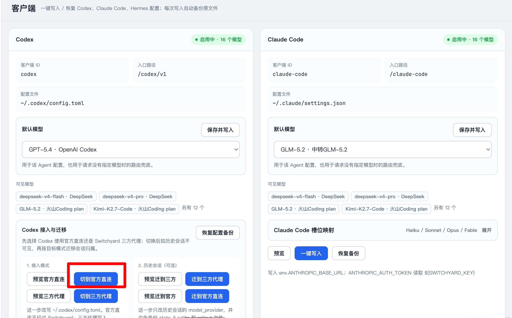

---

## 架构

```
┌─────────────────────────────────────────────────────────┐
│                   Electron Desktop                       │
│  ┌──────────┐ ┌──────────┐ ┌──────────┐ ┌────────────┐  │
│  │ 供应商管理 │ │ 诊断中心   │ │ 会话/日志  │ │ Skills Hub │  │
│  └──────────┘ └──────────┘ └──────────┘ └────────────┘  │
├─────────────────────────────────────────────────────────┤
│                    Gateway Core                          │
│  ┌─────────────────────────────────────────────────┐    │
│  │  HTTP Server: /codex  /claude-code  /hermes  /v1 │    │
│  ├─────────────────────────────────────────────────┤    │
│  │  Protocol Adaptation (Chat ↔ Responses ↔ Msgs)   │    │
│  ├─────────────────────────────────────────────────┤    │
│  │  Compat Patches  │ Vision Fallback  │ Reasoning  │    │
│  └─────────────────────────────────────────────────┘    │
├─────────────────────────────────────────────────────────┤
│  OpenAI │ DeepSeek │ Kimi │ GLM │ Anthropic │ OpenRouter │
└─────────────────────────────────────────────────────────┘
```

---

## 快速开始

### 下载安装

从 [Releases](https://github.com/zhangyinglong3550/switchyard/releases) 下载：

| 平台 | 文件 |
|------|------|
| macOS (Apple Silicon) | `Switchyard-0.5.1-arm64.dmg` |
| Windows (x64) | `Switchyard Setup 0.5.1.exe` 或 `Switchyard-0.5.1-win.zip` |

### 配置环境变量

```bash
export SWITCHYARD_DEEPSEEK_API_KEY="sk-..."
export SWITCHYARD_KIMI_API_KEY="..."
export SWITCHYARD_GLM_API_KEY="..."
# 每个供应商在 UI 中会显示对应的环境变量名
```

### 从源码

```bash
git clone https://github.com/zhangyinglong3550/switchyard.git
cd switchyard
npm install
npm run desktop
```

---

## License

MIT © 2026
