# Switchyard

> 打破 AI 代理的模型孤岛。一份配置，所有模型，所有代理，无缝协作。  
> **2.2**：网关 **可恢复失败自动重试**（默认 3 次，0/429/5xx）· **2.1** 自动更新 / Anthropic OAuth / 账号池 · Claude Paper Light UI。

[]()
[]()
[]()

---

## 你遇到了这些问题吗？

- 在 **Codex** 里只能用官方模型，DeepSeek / Kimi / GLM 的性价比用不上
- 换成 **Claude Code**，又要重新配置一遍 Key，两边模型列表永不统一
- 有一批 **Grok / ChatGPT 订阅号**，却要靠 Sub2API / CLIProxyAPI 另起进程
- 多号时不知道谁还有额度、谁挂了，只能盲猜或一条条 curl
- 想看某个代理发了什么 prompt、为什么失败——日志散落各处

**Switchyard 一次性解决。** 本机桌面应用：左边配模型与账号池，右边 Codex / Claude Code / Hermes 自动生效。

---

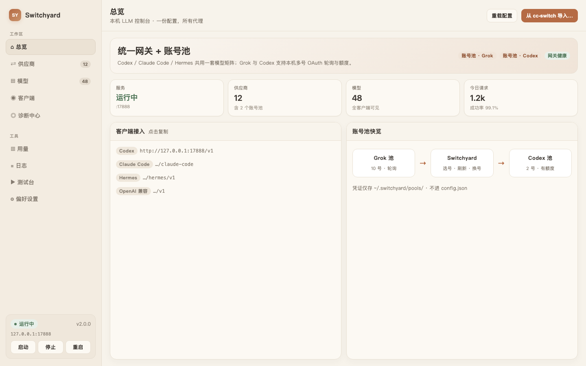

## 演示视频

- [下载/观看产品演示视频（MP4）](docs/assets/videos/switchyard-promo.mp4)

> 若 GitHub 无法内嵌预览，请下载后本地观看。

---

## 2.0 核心：账号池（多账号 OAuth）

**不用 Sub2API，也能在本机跑多 Codex / 多 Grok 号。**

凭证只在 `~/.switchyard/pools/`，**不写进 config.json / 不进 Git**。  
请求路径：选号 → 刷新 token → 上游调用 → 失败自动换号。

### Codex 订阅池

- 直连官方 Responses
- **多选 JSON / 文件夹** 批量导入（CPA `type:codex` 等）
- 无 `refresh_token` 时可用 `session_token` 续 access
- **单号额度**：5 小时窗口 + 周窗口剩余百分比

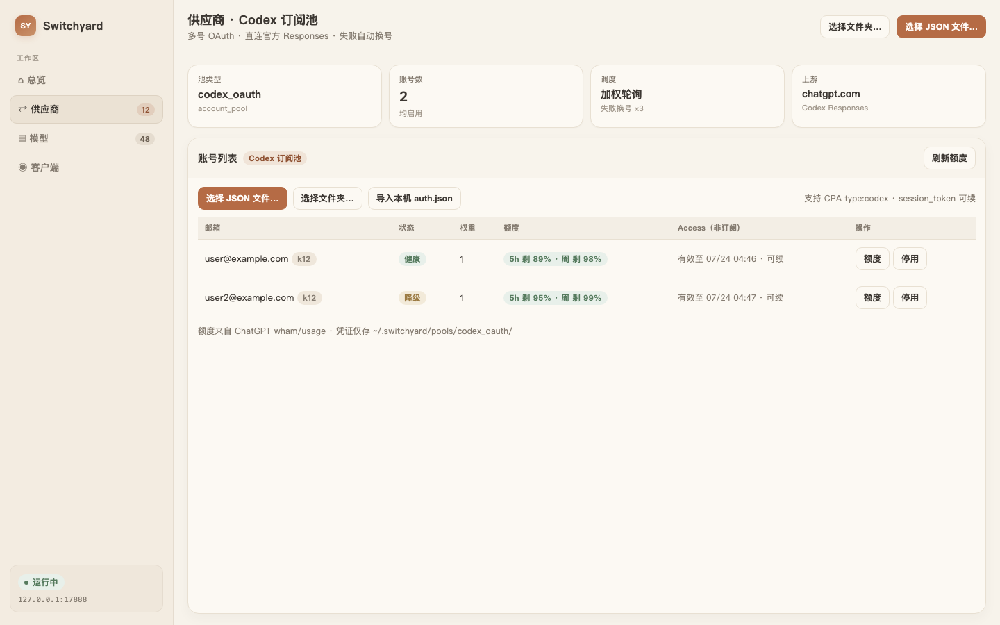

### Grok / xAI 账号池

- 直连 `api.x.ai`（不经过 8317）
- 粘贴 SSO/RT、CPA `xai-*.json`、多选文件
- 加权轮询 / 最久未用 / 最低错误率
- Access 自动续期（有 Refresh 时）

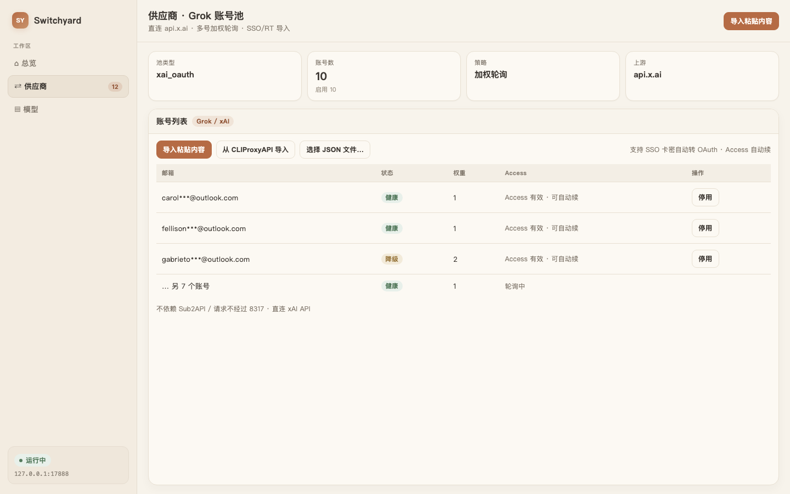

| 池 | 上游 | 导入 | 额度 |
|----|------|------|------|
| **Codex** | chatgpt.com Codex | 多选 json / 文件夹 / 粘贴 / auth.json | **5h + 周剩余** |
| **Grok** | api.x.ai | SSO/RT / CPA json | 官方无稳定公开剩余额度 API |

详细设计：**[账号池文档](docs/ACCOUNT-POOL-MVP.zh-CN.md)** · **[CHANGELOG](CHANGELOG.md)**

---

## 统一供应商与模型矩阵

**一个地方配置，所有代理可用。**

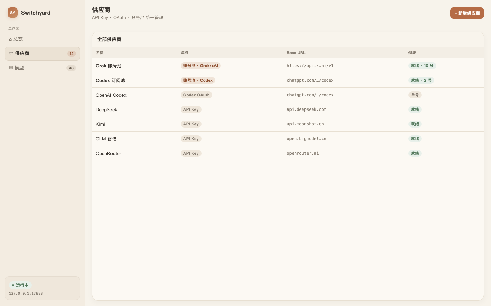

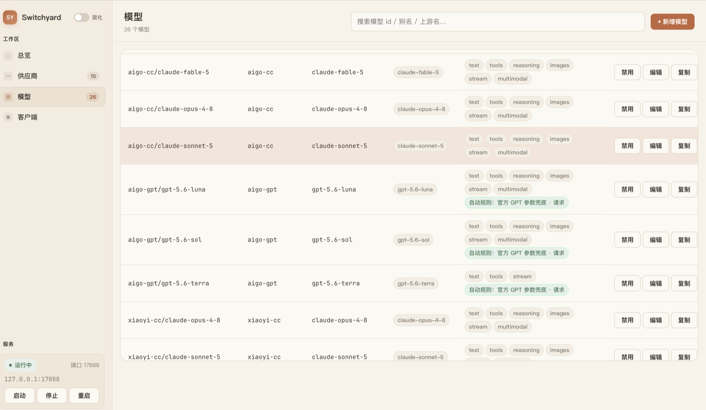

| 供应商 | 协议 | 说明 |
|--------|------|------|
| **Grok 账号池** | Chat + OAuth 池 | 多号轮询 |
| **Codex 订阅池** | Responses + OAuth 池 | 多号 + 额度 |
| OpenAI Codex（单号） | Responses OAuth | 官方 login |
| DeepSeek / Kimi / GLM / MiniMax | Chat | 兼容补丁 |
| Anthropic | Messages | 原生 |
| OpenRouter / 硅基 / 火山等 | Chat | 通用适配 |

配置完成后，**Codex、Claude Code、Hermes** 以及任意 OpenAI/Anthropic 兼容工具同时可见。

---

## 诊断 · 会话 · 调用可视化

### 诊断中心

全量供应商 / 模型可用性检测，错误分类与修复建议。

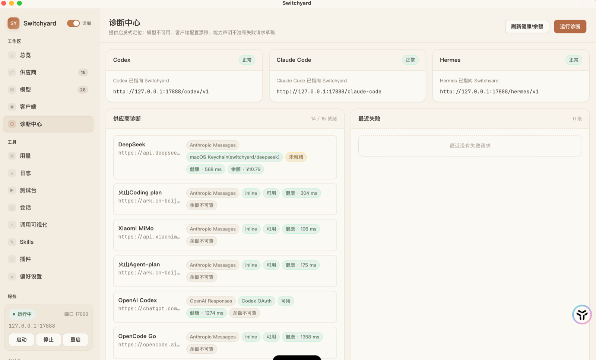

### 会话历史

跨 Codex / Claude Code / Hermes 统一浏览与格式化展示。

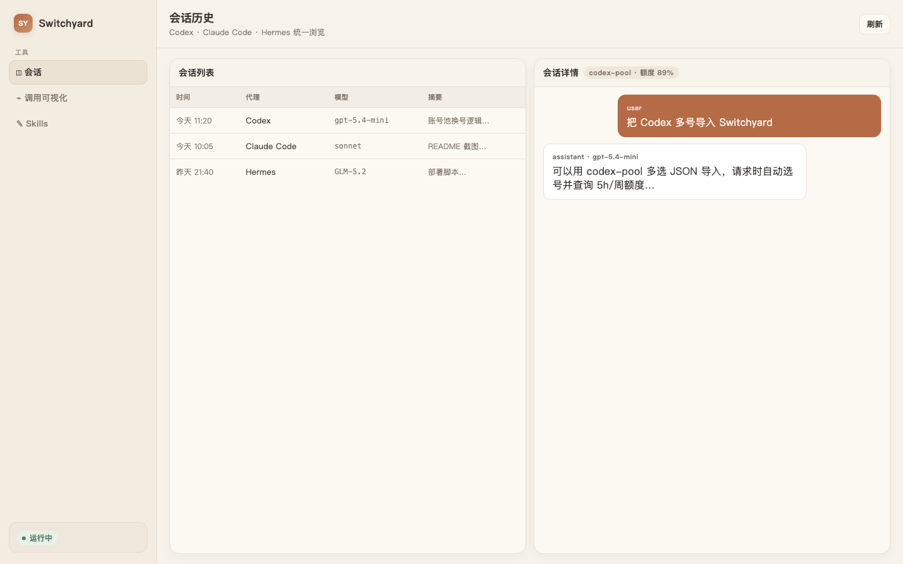

### 调用可视化

实时请求状态、延迟、Token；可看到 **账号池选中了哪个号**、是否触发换号。

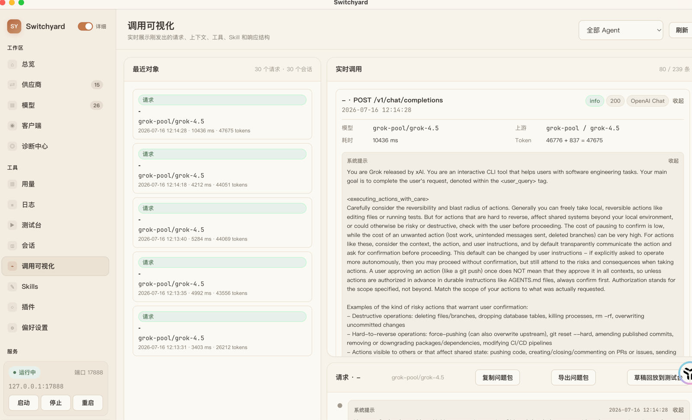

---

## Skills · 视觉 Fallback · 接入模式

### Skills / Skill Hub

统一管理 Codex 与 Claude Code Skills，支持 Skill Hub 搜索安装。

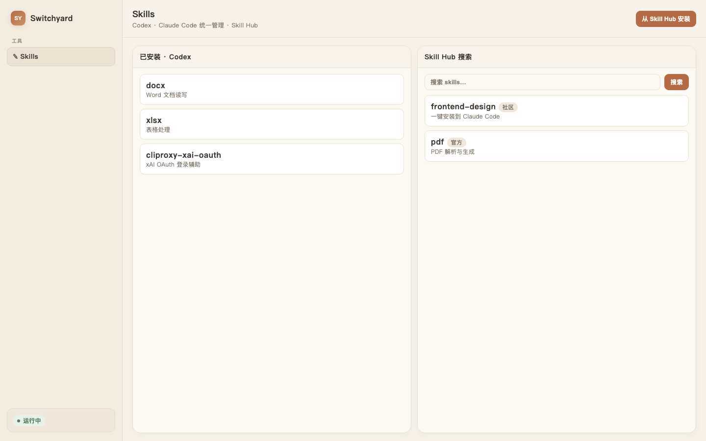

### 非视觉模型识图

贴图 → 视觉模型描述 → 注入 prompt → 目标模型（如 DeepSeek）。

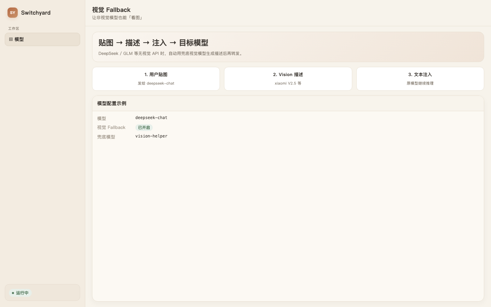

### 架构一览

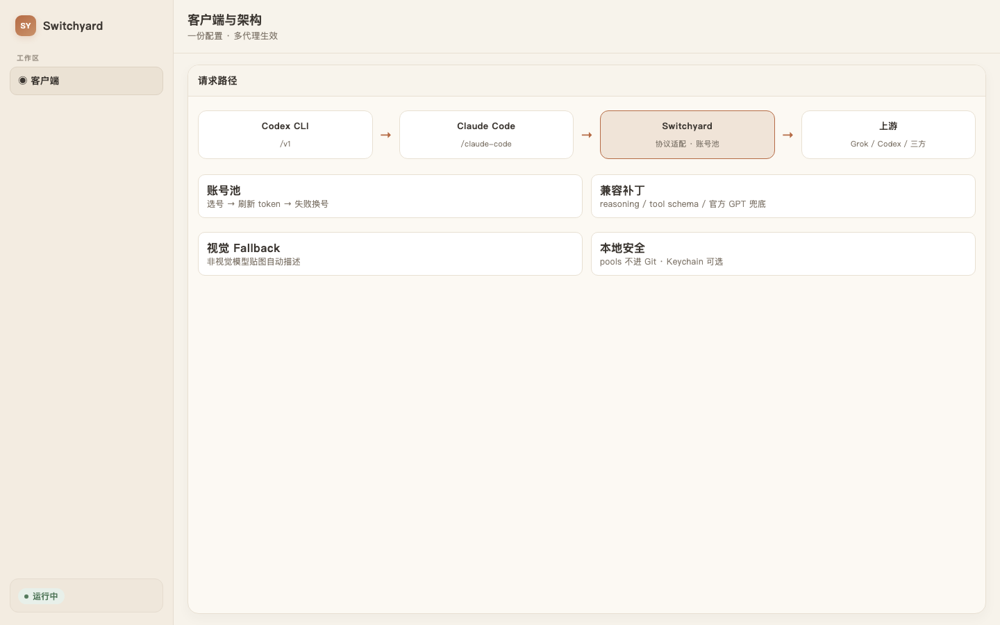

### Codex 官方直连 vs 网关

| 方式 | 原理 | 风险 |
|------|------|------|
| **官方直连**（推荐） | Codex 直连 OpenAI，Switchyard 仅写元数据 | 低 |
| **网关 / 账号池** | 经 Switchyard 转发，可多号轮询 | 可能被识别为代理，仅建议自有账号 |

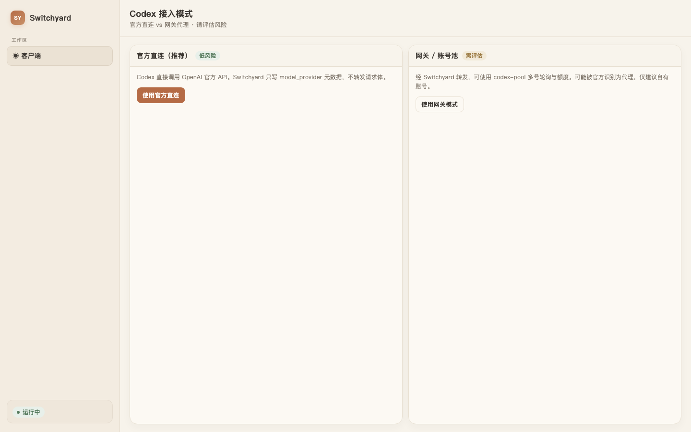

---

## 架构

```
客户端 (Codex / Claude Code / Hermes / …)
        │
        ▼
 Switchyard Desktop + Gateway :17888
   · 协议适配 Chat ↔ Responses ↔ Messages
   · 兼容补丁 / 视觉 Fallback
   · 账号池：选号 → 刷新 → 失败换号
        │
        ├─► api.x.ai          (Grok 池)
        ├─► chatgpt.com/codex (Codex 池)
        └─► 三方 API Key 供应商
```

---

## 快速开始

### 下载安装

从 [Releases v2.2.3](https://github.com/zhangyinglong3550/switchyard/releases/tag/v2.2.3) 下载：

| 平台 | 文件 |
|------|------|
| macOS (Apple Silicon) | `Switchyard-2.2.3-arm64.dmg` |
| macOS (Intel / x64) | `Switchyard-2.2.3.dmg` |
| Windows (x64) | `Switchyard Setup 2.2.3.exe` 或 `Switchyard-2.2.3-win.zip` |

> 已安装 2.0+ 桌面版时，顶栏会提示更新；点击后可下载安装并重新打开。

> ### ⚠️ macOS 用户必读
>
> 无官方签名时可能提示「已损坏」。安装后执行：
>
> ```bash
> xattr -cr /Applications/Switchyard.app
> ```

### 从源码

```bash
git clone https://github.com/zhangyinglong3550/switchyard.git
cd switchyard
npm install
npm run desktop
```

### 环境变量（示例）

```bash
export SWITCHYARD_DEEPSEEK_API_KEY="sk-..."
export SWITCHYARD_KIMI_API_KEY="..."
# 各供应商在 UI 中会显示对应变量名
```

> Antigravity 实验池如需 Google OAuth 刷新，请配置  
> `SWITCHYARD_ANTIGRAVITY_CLIENT_ID` / `SWITCHYARD_ANTIGRAVITY_CLIENT_SECRET`（仓库不硬编码）。

---

## 截图说明

本 README 配图为 **2.0 Claude Paper Light** 界面示意（产品 UI 高保真 mock，与当前主题一致），用于展示核心能力与账号池工作流。旧版 1.x 截图已备份至 `docs/assets/screenshots/_backup-1x/`。

---

## License

MIT © 2026
