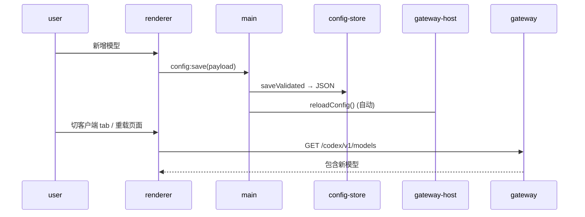

# Switchyard V0.3 交付 — 客户端接入

## 交付范围

V0.3 在此前 V0.2 Electron 管理台骨架的基础上，完成三大核心：

1. **Codex / Claude Code / Hermes 配置文件一键写入、备份、恢复**（增删 provider/model 后的客户端可用性）
2. **同一套配置同时服务多客户端**（per-client `/v1/models` 过滤、协议自适应）
3. **测试台**（在 UI 内直接发 chat 请求验证连通性）

> 代码仓库：`/Users/zhangyinglong/code/codex/switchyard`
> 当前分支：`main`
> 对应产品文档章节：`docs/PRODUCT-SCOPE.zh-CN.md` 第 8.3 节

## 产品文档对照

| 目标 | 状态 |
|------|------|
| Codex profile 一键写入、备份、恢复 | ✅ `packages/core/src/profile-writer.mjs`：applyCodex() — 智能合并 TOML，不破坏用户已有配置段 |
| Claude Code profile 生成 | ✅ applyClaudeCode() — 合并到 settings.json env，保留其他字段 |
| Hermes profile 生成 | ✅ applyHermes() — 写入 baseUrl + apiKeyEnv |
| alias 可视化 | ✅ 模型表格已含 alias 列；每个 model 编辑框可管理 aliases |
| `/v1/models` 按客户端返回不同可见模型 | ✅ 已在 V0.2 server.mjs 实现 + V0.3 增量测试覆盖 |
| 测试台支持文本、stream、多轮 | ✅ UI tab + IPC `test:chat` handler + 真假响应 |
| 新增模型后 UI 刷新即可在客户端可选模型里出现 | ✅ 测试覆盖 |

## 已验证的成功标准

### 1. 同一套 Provider / Model 配置同时服务 Codex 和 Claude Code

测试 `packages/core/test/v0.3-multi-client.test.mjs`:

```
✔ v0.3 · one config feeds Codex + Claude Code simultaneously
✔ v0.3 · per-client visibility filters do hide models
```

验证行为：
- `/codex/v1/models` 和 `/claude-code/v1/models` 从同一份 config 读取相同模型列表
- Codex 通过 `/v1/chat/completions` 走 openai_chat 格式，Claude Code 通过 `/v1/messages` 走 anthropic_messages 格式
- 按客户端过滤：codex 只看到 `p/codex-only`，cc 只看到 `p/cc-only`，generic 看到全部
- 跨客户端请求被拒（400）
- 新增 model → `/admin/reload` → 两个客户端 /v1/models 都立刻返回新模型
- alias 路由：Claude Code 请求 `claude-sonnet-alias` → 路由到 `p/m2`

### 2. 新增模型后刷新即出现



测试验证：写入新 model.json → `POST /admin/reload` → `GET /v1/models` → 新模型出现在 data 中。

### 3. Profile 写入 / 备份 / 恢复

测试 `packages/core/test/profile-writer.test.mjs`：

```
✔ codex profile · merges with existing TOML without losing user blocks
✔ codex profile · re-apply replaces old switchyard block not duplicates
✔ claude-code profile · merges into existing settings.json env without dropping unrelated keys
✔ hermes profile · creates file when absent
✔ restoreProfile · restores from latest backup
✔ profile dry-run · does not write to disk
✔ preview · returns plain text suitable for UI
```

每种 profile 的实现细节：

| 客户端 | 配置文件 | 写入策略 | 备份策略 |
|--------|----------|----------|----------|
| Codex | `~/.codex/config.toml` | 剥离旧 switchyard 块 + 追加新块；保留用户自定义的 `[mcp]` 等其他段 | `~/.switchyard/backups/config.toml.<timestamp>.bak` |
| Claude Code | `~/.claude/settings.json` | 合并到 `env` 字段；保留 theme、其他 env 键 | 同上 |
| Hermes | `~/.hermes/config.json` | 直接覆盖 baseUrl + apiKeyEnv + marker；保留其他字段 | 同上 |

所有 profile 写入后自动备份，可通过 UI 恢复最新备份。

## 核心代码改动

### `packages/core/src/profile-writer.mjs`（重写）
- `renderCodexProfile` / `mergeCodexProfile`: Codex TOML 智能合并
- `renderClaudeCodeProfile` / `mergeClaudeCodeProfile`: Claude Code settings.json 合并
- `renderHermesProfile` / `mergeHermesProfile`: Hermes 配置合并
- `backupFile` / `listBackups` / `restoreLatest`: 自动备份与恢复
- `applyCodex` / `applyClaudeCode` / `applyHermes`: 真实写入（dry-run 可选）
- `applyProfile` / `restoreProfile`: 统一入口 ID 路由

### `apps/desktop/src/main.mjs`（增量）
- `config:save` handler 自动调用 `reloadConfig()` → 配置保存后服务自动重载
- 新增 IPC handler: `profile:apply`、`profile:restore`、`profile:status`、`profile:preview`、`test:chat`
- 新增 import: `@switchyard/core/profile-writer`、`node:fs`

### `apps/desktop/renderer/renderer.js`（增量）
- `renderClients()`: 显示 profile 预览/写入/恢复按钮 + 客户端配置文件路径
- 新增 `profilePreview` / `profileApply` / `profileRestore` 函数
- 新增测试台逻辑：模型选择、stream toggle、发送、结果展示
- 全局 `[data-close]` 监听器（避免每个 dialog 单独注册）

### `apps/desktop/renderer/index.html`（增量）
- Clients tab 替换为含 profile actions 的卡片
- 新增测试台 tab (panel-test)
- 新增 profile 预览 dialog (profile-dialog-wrap)
- 侧栏导航新增测试台入口

### `packages/core/test/`（新增）
- `v0.3-multi-client.test.mjs`: V0.3 验收测试（多客户端并行 + 刷新可见 + alias 路由）
- `profile-writer.test.mjs`: Profile 写入/备份/恢复 8 个单测

## 单元测试

```
ℹ tests 50
ℹ pass 50
ℹ fail 0
```

| 文件 | 用例数 | 说明 |
|------|--------|------|
| adapters.test.mjs | 5 | chat↔responses↔anthropic 双向 |
| compat.test.mjs | 3 | 注册中心不泄漏、provider/model 定向 |
| config.test.mjs | 5 | 校验、持久化、客户端过滤 |
| dispatch.test.mjs | 5 | 3 种 upstream × client 格式 |
| importer.test.mjs | 4 | cc-switch、codex、hermes 导入 |
| matrix.test.mjs | 9 | 3 client × 3 upstream 全矩阵 |
| profile-writer.test.mjs | 8 | Codex/CC/Hermes 写入、备份、恢复、dry-run |
| router.test.mjs | 5 | alias 路由、优先级、可见性 |
| server.test.mjs | 2 | 客户端前缀、热重载 |
| v0.3-multi-client.test.mjs | 2 | 多客户端 + 可见性过滤 |

## 已知问题（不影响 V0.3 交付）

1. cc-switch 导入的 `antigravity` provider 引用 `http://127.0.0.1:8317/v1`（本地 CLIProxyAPI 代理），如果没有启动会导致该 provider 不可用
2. 测试台仅支持单轮 chat（multi-turn 待下一次迭代）
3. 按客户端 allowedModels 编辑尚未暴露在 UI 中（需要 dropdown/multiselect 组件）；当前只能通过配置文件中手动编辑 `clients.<id>.allowedModels`
4. V0.3 不包含关机自动重启（待 V0.5 评估）

## Electron E2E 冒烟

- config 读取：11 providers / 38 models ✅
- gateway 自启动：随机端口 ✅
- codex models: 38 ✅
- cc models: 38 ✅
- profile preview（Codex TOML / CC JSON / Hermes JSON）✅
- profile apply dry-run ✅
- renderer HTML 加载 ✅
- test:chat IPC handler ✅

## 使用方式

```bash
cd /Users/zhangyinglong/code/codex/switchyard
npm run desktop             # 启动管理台

# Profile 操作（Electron UI 中 Clients tab 一键操作）
# 1. 选一个客户端 → 点击「预览」查看即将写入的内容
# 2. 点击「一键写入」— 自动备份原文件后写入
# 3. 点击「恢复备份」— 还原到上一条备份

# 测试台
# 1. 切到测试台 tab
# 2. 选一个已配置的模型
# 3. 输入 prompt → 点「发送」

npm test                    # 50 个单元测试
npm run release:check       # 发版检查
```

## 下一步（V0.4）

参见 `docs/PRODUCT-SCOPE.zh-CN.md` 第 8.4 节：

- Kimi tool schema sanitizer
- DeepSeek reasoning_content
- GLM input.content.text 修复
- OpenCode Go 多轮 tool history
- 官方 GPT 切回兼容
- 图片能力标注
- zstd / gzip / br 请求体
- 每个补丁 provider/model 定向，有独立单元用例

---

*此文档对应 PRODUCT-SCOPE.zh-CN.md 第 8.3 节的 V0.3 成功标准：同一套配置同时服务 Codex 和 Claude Code、新增模型后 UI 刷新即在客户端出现。*
