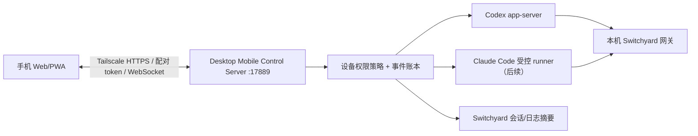

# Switchyard 移动控制一期方案

> 调研更新：2026-07-23
> 当前状态：**P0 已落地开发版：Codex / Claude Code / Grok / OpenCode 控制面、配对、设备撤销、PWA 会话控制、事件补拉和低风险一次性审批已接通；尚未作为生产远程服务发布。**

## 调研结论

### OpenCodex 实际提供了什么

截至调研提交 `9e68ed67303580ecf0bcde0a56b71b874304fc54`：

1. 它的 Web Dashboard 是响应式网页：窄屏时左侧导航改为抽屉，因此可以在手机浏览器上管理 Provider、模型、日志和服务。
2. 它默认仅绑定 `127.0.0.1`；配置为非 loopback 地址时，要求配置 admission token，并同时保护 `/api/*` 管理面和 `/v1/*` 数据面。
3. 它的“mobile-connected session”出现在 Codex 账号池的会话粘性语义里，不代表它实现了一套能在手机上直接运行 Codex / Claude Code 的移动 Agent Runtime。

**不应照搬的部分：** OpenCodex 的 Dashboard 管理面能修改 Provider、OAuth、API Key、服务生命周期和完整请求日志。把这一整面 API 暴露到手机，即使加一个 bearer token，也会把 Switchyard 的最高权限管理能力带出桌面端。

### CC Switch 给我们的关键启发

截至调研提交 `a377d79303bc1e592d2783d559ca5bd6b8ba1417`：

1. 第三方模型接管应只写 `~/.codex/config.toml` 的路由配置，不应覆盖官方 `~/.codex/auth.json`。
2. 保留官方 Codex 登录态，才有机会同时保留 Codex App 所依赖的官方能力（CC Switch 文档把远程操作和官方插件列为目标）；该点需要在本机真实账号上做烟测，不把第三方项目说明当作最终事实。
3. Claude Code 的第三方协议转换与移动端是两回事：移动端只应控制受管会话，协议转换、密钥注入、流式修复仍必须留在本机 Switchyard。

### Switchyard 当前基础

- Codex 的 `switchyard_proxy` profile 只管理 `config.toml`、模型 catalog/cache；`applyCodex()` 不写 `auth.json`。
- 已有 `CodexAppServerClient`，可用 `codex app-server --stdio` 启动、创建 thread、注入消息和读取 thread。
- 当前 `CodexAppServerClient` 只处理 JSON-RPC response，尚未消费 app-server notification；要做手机实时输出，必须先补全事件订阅、断线恢复和明确终态。
- 当前本地网关只有数据面协议入口，不适合作为手机的管理面；移动控制服务应是独立、最小权限的控制面。

### 当前已实现的移动控制面

- Electron 主进程按需启动 `127.0.0.1:17889`，默认不启动，不复用 `17888`。
- 手机端只拿到固定 DTO：会话标题、Agent、项目名、状态、模型和脱敏消息；Provider、API Key、OAuth、原始日志和任意 Shell 不进入移动 API。
- Codex 使用 `codex app-server --stdio`；Claude Code、Grok、OpenCode 使用 ACP stdio。
- Grok 的 ACP 当前没有 `session/list`，Switchyard 从 `~/.grok/sessions/**/summary.json` 读取索引，再通过 ACP `session/load` 继续会话；这部分依赖 Grok 本地会话格式，版本升级需回归。
- 手机上的模型切换只对下一轮生效；发送消息使用 `message_id` 幂等；同一会话有写入租约。
- 仅低风险且存在 `allow_once` / `reject_once` 的 ACP 操作可在手机处理；永久允许、高风险、未知风险操作必须回桌面。

## 目标

让手机作为**本机桌面 Agent 的受控控制台**：

- 继续/新建 Codex 任务；
- 查看并回复 Claude Code 已授权会话；
- 查看任务状态、流式输出与待确认操作；
- 不把 API Key、桌面文件系统或任意 shell 暴露到手机。

手机不是新的模型网关，也不直接保存供应商凭据；模型请求仍由桌面端 Switchyard 发起。

## 产品分层：不要把两个“手机端”混为一谈

| 能力 | 推荐方案 | 首期是否实现 |
| --- | --- | --- |
| 在手机继续 Codex 官方任务 | **保留 Codex 官方登录态**，让 Codex App 自己提供其官方远程能力 | 先做真实烟测与防回归，不重造 |
| 在手机统一看 Codex / Claude Code / 其他 Agent | Switchyard Mobile Control PWA，连接桌面端受控控制服务 | 是 |
| 在手机修改 Provider、导出密钥、查看原始请求 | 不支持 | 否 |
| 让手机直接成为 CLI / shell | 不支持 | 否 |

CC Switch 的代理侧经验应复用到移动事件通道：流不能靠 socket EOF 推断成功；必须以协议终态事件、显式错误帧、UTF-8 分块与空闲 watchdog 判断任务状态。

## 一期边界

### 支持

1. 桌面 App 启动一个**独立于模型网关、默认仅 loopback** 的移动控制服务。
2. Desktop 页面展示一次性配对二维码/六码；远程模式优先通过 Tailscale HTTPS 完成配对，而不是裸 LAN HTTP。
3. 手机可读取 Switchyard 管理的任务摘要、实时输出、待确认状态。
4. Codex 使用现有 `codex app-server --stdio` 能力创建任务、注入消息。
5. Claude Code 先支持读取现有会话和“发送到受控本地 runner”的明确动作；未实现稳定 runner 前，不伪造“可控制”。
6. SSE/WebSocket 只传受限的任务事件和用户文本，不传本机路径树、环境变量、原始请求日志或任何密钥。

### 明确不支持

- 公网裸露端口；
- 直接把 `17888` 网关、Desktop IPC 或完整管理 API 暴露给手机；
- 手机侧任意命令执行、任意文件读写；
- 代替桌面端审批/沙箱；
- 从手机导出 Provider API Key、OAuth token 或完整请求内容。

## 架构



## 安全模型

1. **关闭即不可访问**：服务默认关闭，且只绑定 `127.0.0.1`。
2. **不开放 LAN bind**：P0 固定只监听 `127.0.0.1`，远程访问由 Tailscale Serve 终结。
3. **短期配对码**：二维码只含一次性 challenge，10 分钟失效且只能完成一次设备注册。
4. **设备 token**：注册后保存经系统 Keychain 保护的设备标识；可在桌面端逐台撤销。
5. **最小动作集**：动作采用 allowlist（新建、续聊、切换下一轮模型、停止、改名、归档、Fork、删除、压缩），不提供通用 RPC、shell 或任意文件路径读取。
6. **审批回流**：高风险动作仅显示“等待桌面确认”；移动端不能绕过 Codex/Claude 的原生审批。
7. **日志脱敏**：沿用 request-log 的脱敏摘要；默认不向手机下发 prompt 全文、原始 provider headers 或 token。
8. **事件幂等**：每次用户发送附带 `message_id`；服务端持久化已受理 ID。重连使用单调递增 `event_id` 补拉，禁止根据 UI 重试重复注入一条 prompt。
9. **分离凭据域**：设备 token 只能访问 `/mobile/v1/*`，绝不能作为 Provider、Codex OAuth 或网关数据面的 authorization header。

## 当前 API

```text
POST /mobile/pair/complete       # 手机提交桌面生成的一次性 challenge
GET  /mobile/v1/agents           # 已授权 Agent 与能力
GET  /mobile/v1/sessions         # 脱敏任务列表
GET  /mobile/v1/sessions/:id     # 任务摘要与分页事件
GET  /mobile/v1/events           # WebSocket/SSE，任务状态与输出增量
GET  /mobile/v1/approvals
POST /mobile/v1/approvals/:id/resolve
POST /mobile/v1/devices/self/revoke
```

所有 `/mobile/v1/*` 需要设备 token；消息使用 `message_id` 防止断线重试重复注入。服务端保存 token 哈希而不是明文 token。

### Tailscale Serve

移动控制服务只监听本机回环地址。确认桌面端已启用后，在桌面终端执行：

```bash
tailscale serve --bg 17889
tailscale serve status
```

手机加入同一 Tailnet 后，使用 `tailscale serve status` 显示的 HTTPS 地址访问 PWA。桌面端生成的一次性链接默认是回环地址，远程配对时把链接中的 `127.0.0.1:17889` 替换为该 HTTPS 主机名，保留 `?challenge=...` 参数。不要执行 `tailscale funnel`。

## 交付顺序

0. **M0（Codex 官方远程烟测）**：在「官方登录 + Switchyard 代理 + 三方模型」组合下验证 `auth.json` 未被改写、Codex App 官方远程能力可用、切回官方模式可恢复。补 profile-writer 回归测试，把“绝不写 auth.json”固定下来。
1. **M1（协议稳定性）**：完成网关流终态、显式错误与跨协议工具/推理历史回归测试；移动事件只能消费已经判定为 `completed`、`failed`、`cancelled`、`incomplete` 的任务状态。
2. **M2（只读 PWA）**：独立 `:17889` 控制面、桌面配对、设备管理、任务摘要、事件补拉和实时状态。首版只允许本机访问；先交付浏览器可用页面，不承诺安装型 PWA。
3. **M3（Codex 写入）**：扩展 `CodexAppServerClient` 以处理 notification；接入任务新建、消息注入、桌面确认与 message idempotency。
4. **M4（Claude Code 写入）**：先实现受控 local runner（固定 cwd allowlist、显式命令模板、审批回流）；不直接修改 `~/.claude` 会话文件来伪造执行。
5. **M5（远程访问）**：Tailscale HTTPS 优先；确认设备 token、撤销、重放保护和断网恢复后，再允许从手机外网访问。除非用户明确自管，不提供匿名公网 Tunnel。

## 验收标准

- 配对 token 过期、重复使用、设备撤销均被拒绝；
- 手机无法读取任何 API Key、认证头、任意文件或完整原始请求日志；
- 手机设备 token 不能调用 `/codex/v1/*`、`/claude-code/v1/*`、`/admin/*` 或 Desktop IPC；
- Codex 手机续聊能在桌面任务中看到相同消息与状态；
- 上游流中断时，手机收到明确 `failed` / `incomplete`，不会停在“生成中”；
- 断网重连后，客户端按任务事件序号补拉，不重复发送用户消息。
