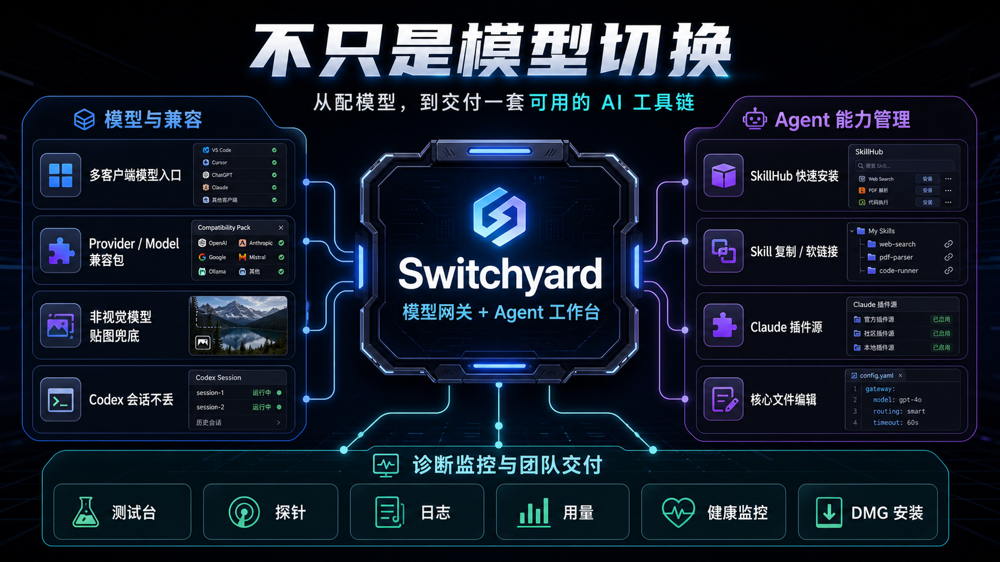

# Switchyard 功能纪要

> 一句话：Switchyard 不是“再造一个 ccswitch”，而是把模型网关、Agent 能力管理、诊断监控和团队交付放在同一个本机工作台里。

## 为什么还需要 Switchyard

ccswitch 已经解决了很多模型配置切换问题，也有供应商 / 模型维度配置和兼容适配能力。OpenCodex 也在 Codex 体验增强、图形化管理、Vision Bridge 等方向做了不少探索。

Switchyard 的切入点不是否定这些工具，而是把“模型能不能接上”继续往后推进一步：当团队里同时有人用 Codex、Claude Code、Hermes，又需要接 OpenAI、DeepSeek、GLM、Kimi、火山和各种 OpenAI-compatible / Anthropic-compatible 网关时，真正影响日常效率的不是单个模型能不能请求成功，而是整套 Agent 工具链能不能稳定交付。

典型痛点包括：

- Codex 能对话，但模型列表为空，或者切换后历史会话归属变了。
- Claude Code 需要看到三方模型，并按 Anthropic Messages / SSE 的格式稳定工作。
- 非视觉模型收到截图、界面图、报错图时不能直接处理。
- Provider 和 Model 的兼容差异需要沉淀成规则，而不是每次手工改配置。
- 同一个 Skill 想复用到 Codex、Claude Code、Hermes，却要分别找目录、复制文件、改开关。
- Claude Code 插件源、marketplace、本机已安装插件缺少一个统一视图。
- 出现空白响应、断流、超时、工具调用失败时，缺少测试台、探针、日志和健康状态来定位问题。

Switchyard 要做的是把这些高频动作集中到一个桌面工作台里：配模型、测模型、修兼容、管 Skill、管插件、看会话、改核心文件、查日志、发给同事安装。

## 能力地图

| 能力域 | Switchyard 做什么 | 用户得到什么 |
| --- | --- | --- |
| 多客户端模型入口 | 同一套 Provider / Model 配置服务 Codex、Claude Code、Hermes、OpenAI-compatible、Anthropic-compatible | 不用为每个 Agent 重配一遍模型 |
| Provider / Model 管理 | 支持供应商和模型维度的能力、可见范围、默认模型、代理、兼容补丁 | 通用规则放供应商，特殊规则放模型，配置更少、更清楚 |
| Codex 接入 | 保持 `model_provider = "custom"`，维护 Codex 可识别的模型目录和缓存 | 三方模型可见，同时不把会话拆到另一套 provider 里 |
| Claude Code 接入 | 提供 Claude Code 专用模型发现和 Anthropic Messages/SSE 兼容入口 | Claude Code 可以选择 DeepSeek、GLM、Kimi、Codex GPT 等模型 |
| 非视觉模型贴图兜底 | 识别模型图片能力，不支持图片时走视觉模型兜底，再把图像理解结果交给目标模型 | 用户照常贴图，不用临时换模型或手工 OCR |
| 兼容包机制 | 按 Provider / Model 定向处理 tool call、reasoning、JSON Schema、developer role、stream 等差异 | “这个模型有点怪”可以沉淀成可复用、可回归的规则 |
| 测试台 | 支持文本、stream、tool call、图片、reasoning、多轮，展示原始 / 转换后请求响应 | 接模型时能直接看协议转换和上游返回，不靠猜 |
| 诊断与监控 | 探针、Provider 健康监控、请求日志、用量统计、错误追踪 | 出问题能判断是模型、协议、网络、缓存还是客户端配置 |
| Agent 会话管理 | 读取 Codex / Claude Code / Hermes 会话，Hermes 支持归档 | 排查“刚才那轮到底发生了什么”更直接 |
| Agent 核心文件 | 管理 Codex `AGENTS.md` / `config.toml`、Claude Code `CLAUDE.md` / `settings.json`、Hermes `AGENTS.md` / `SOUL.md` / memory 等 | 不用在多个隐藏目录里找配置文件 |
| Skill 管理 | 列出、查看、编辑、启用 / 禁用、删除 Codex / Claude Code / Hermes Skills | Skill 成为可管理资产，不是散落的文件夹 |
| Skill 复制 / 软链接 | 将一个 Agent 的 Skill 复制到另一个 Agent，或用软链接复用同一份内容 | 一次维护，多 Agent 共享 |
| SkillHub 快速安装 | 搜索 skillhub.cn，查看详情，下载 zip，直接安装到目标 Agent | 从“找到 Skill”到“装进 Agent”少走很多手工步骤 |
| Claude Code 插件管理 | 管理插件源、读取 marketplace、展示已安装插件和可用插件 | 插件源和插件状态有统一视图 |
| 团队交付 | DMG 安装包、首次启动导入 cc-switch 配置、同事安装手册、配置模板 | 可以发给同事，而不是只停留在本机脚本 |

## 三个最容易被感知的优势

### 1. 从“模型切换”到“Agent 工作台”

模型切换解决的是“当前请求走谁”。Switchyard 继续管理“这个模型被哪些 Agent 看见、默认给谁用、是否支持图片、tool call 要不要改写、日志怎么查、会话在哪看、相关 Skill 和插件怎么安装”。

这也是它和单纯配置切换工具的主要边界：Switchyard 不只关心 provider 当前是谁，还关心每个 Agent 拿到模型之后能不能真正工作。

### 2. Skill 和插件变成一等公民

Agent 越用越重，价值不只在模型，还在 Skills、插件、核心配置和历史会话。

Switchyard 把这些资源放进桌面管理台：

- Skill 可以按 Agent 过滤、编辑、禁用、删除。
- 常用 Skill 可以通过软链接复制到另一个 Agent，避免多份内容漂移。
- SkillHub 可以直接搜索、下载、安装到 Codex / Claude Code / Hermes。
- Claude Code 插件源可以添加、查看、移除，也能看到 marketplace 里的可用插件。
- 核心文件可以直接读取和保存，适合团队内统一初始化或排障。

这部分是推广时最该强调的差异：它不是只帮你“换模型”，而是在管理 Agent 运行所依赖的能力包。

### 3. 兼容和诊断能沉淀

多模型接入最怕“今天手工修好了，明天另一个模型又坏”。Switchyard 把兼容问题拆成可定位、可复用的规则：

- Provider 级问题放到供应商维度，例如同一供应商的 tool call 或 stream 差异。
- Model 级问题放到模型维度，例如某个模型独有的 reasoning 字段、JSON Schema 限制或图片能力声明。
- 客户端可见范围和默认模型按 Agent 配置，避免 Claude Code、Codex、测试台互相影响。
- 测试台和日志记录原始请求、转换后请求、上游响应、转换后响应，方便复现。

结果是：一个团队踩过的坑可以沉淀进 Switchyard，后面的人安装后直接复用。

## 和 ccswitch / OpenCodex 的边界

| 工具 | 更适合的场景 | Switchyard 的补位 |
| --- | --- | --- |
| ccswitch | 快速切换 provider / model，维护多供应商配置和一定范围内的兼容适配 | 当你还需要 Codex / Claude Code / Hermes 同时可用、模型目录统一、会话归属稳定、Agent Skill / 插件 / 核心文件一起管理时 |
| OpenCodex | 围绕 Codex 的体验增强、图形化配置、Codex 相关桥接能力 | 当你的需求不止 Codex，还包括 Claude Code、Hermes、Anthropic-compatible、团队安装和跨 Agent 资源管理时 |
| 手写 JSON / TOML | 临时验证一个模型或本机自用 | 当配置要交给别人用、要排障、要看日志、要沉淀兼容规则时 |

更准确的说法是：

> ccswitch 更像“模型配置切换器”，OpenCodex 更像“Codex 增强工具”，Switchyard 更像“本机 Agent 工具链控制台”。

## 适合对外介绍的一句话

Switchyard 让团队不用只讨论“模型能不能请求通”，而是直接交付一套可用的本机 AI 工具链：模型接入、协议兼容、图片兜底、测试诊断、Skill 安装复用、Claude 插件源、会话和核心文件管理，都在一个桌面工作台里完成。

## 推荐展示路径

给同事演示时，可以按这个顺序：

1. 导入 cc-switch 配置，展示同一批模型同时出现在 Codex、Claude Code、Hermes 入口。
2. 在测试台发文本、stream、tool call、图片请求，展示原始 / 转换后请求响应。
3. 用非视觉模型贴一张截图，展示视觉兜底结果。
4. 打开 Skill 页面，搜索 SkillHub 并安装到 Codex，再软链接复制到 Claude Code。
5. 打开插件页面，添加 Claude Code 插件源，查看 marketplace 和已安装插件。
6. 打开诊断、日志、用量和健康监控，说明出了问题怎么定位。
7. 最后展示 DMG 和安装手册，说明这不是本机临时脚本，而是可以交付给团队的工具。

